# Création d’une VM sous VMWare

## Création de la VM

<u>Etape 1:</u> Appuyer sur le bouton de création

<u>Etape 2:</u> Attention: ne pas choisir _Typical_, choisir _Custom_

<u>Etape 3:</u> Cliquer sur `Next`

<u>Etape 4:</u> Sélectionner l'iso d'installation

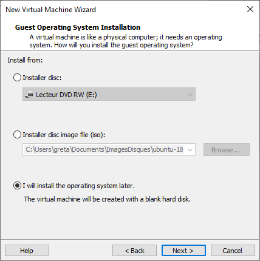

<u>Etape 5:</u> Ne pas sélectionner l'iso d'installation pour le moment

<u>Etape 5:</u> Choisir `Linux`

<u>Etape 6:</u> Donner un nom à la machine virtuelle

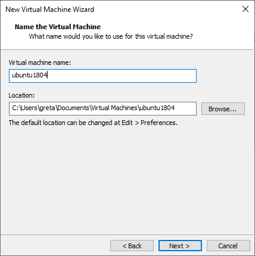

<u>Etape 7:</u> Choisir 2 processeurs et un coeur par processeur

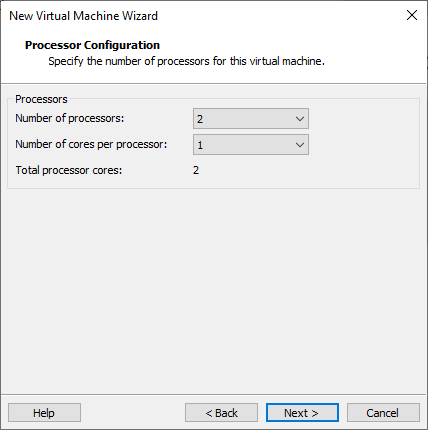

<u>Etape 8:</u> Choisir 4Go de RAM

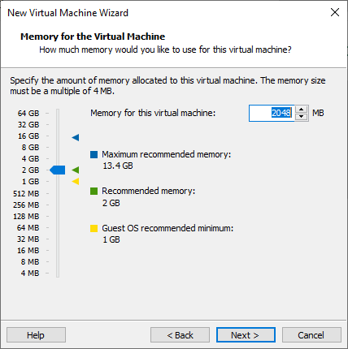

<u>Etape 9:</u> Choisir `NAT`

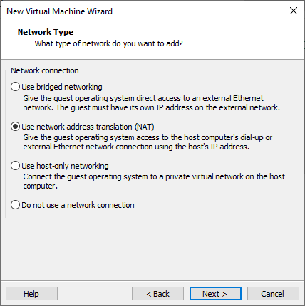

<u>Etape 10:</u> Choisir `LSI Logic (Recommanded)`

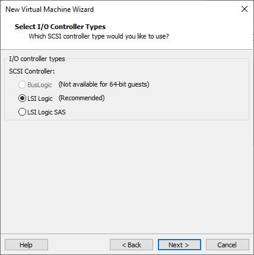

<u>Etape 11:</u> Choisir `SCSI (Recommanded)`

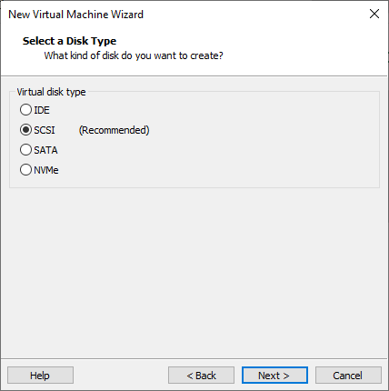

<u>Etape 12:</u> Choisir `Create a new virtual disk`

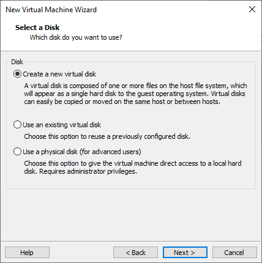

<u>Etape 13:</u> Choisir une taille de disque de 25Go et `Split virtual disk`

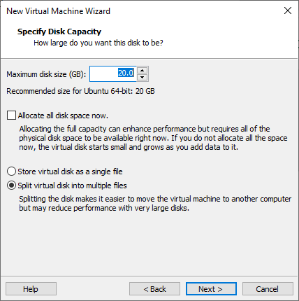

<u>Etape 14:</u> Ne rien changer et cliquer sur `Next` puis `Finish`

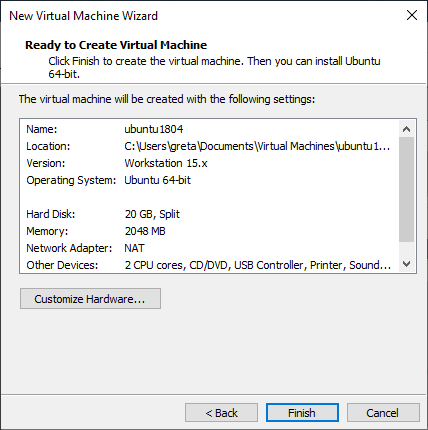

<u>Etape 15:</u> Cliquer sur **CD/DVD** et choisir l'iso d'installation

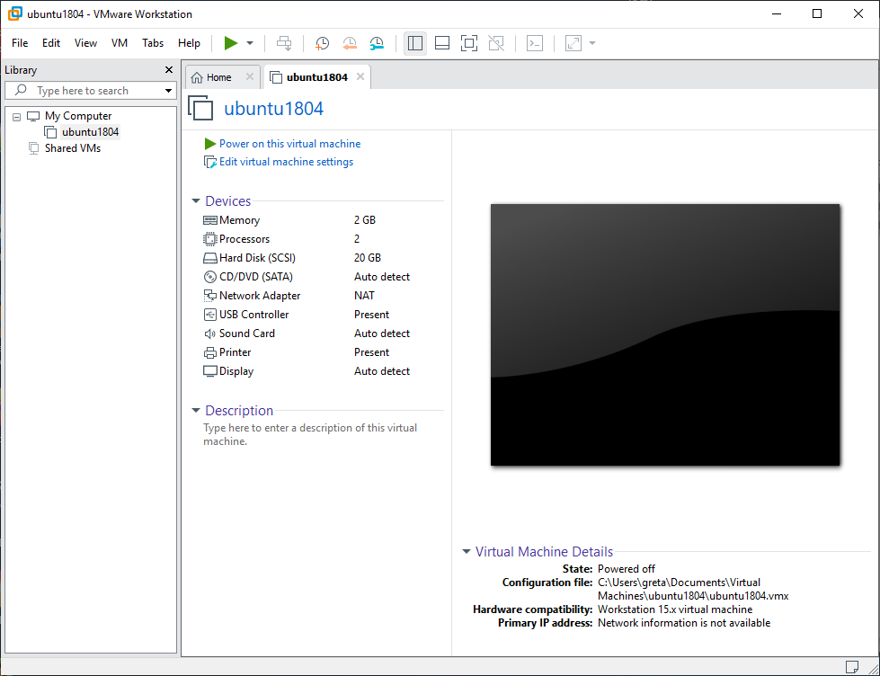
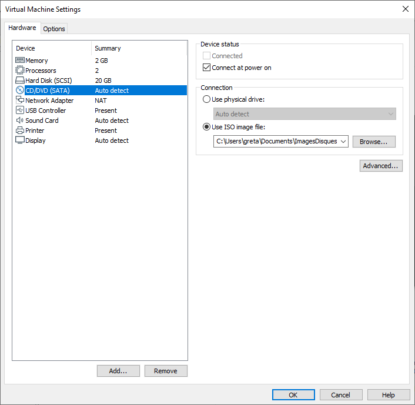
