## Installation du rôle ADDS

Active Directory Domain Services (ADDS) est le rôle serveur permettant notamment la mise en place du Domain Controller (DC) qui est essentiel pour la communication entre le réseau et les machines qui y sont connectées. AD est avant tout un service d’annuaire (base de données) qui offre également d’autres services d’administration tels que la gestion des mises à jour, des droits d’accès ou encore des unités organisationnelles. L’infrastructure AD s’organise selon un modèle de forest pouvant regrouper plusieurs domain.

Afin de le mettre en place l’ADDS, dans l’interface Server Manager, il est nécessaire de créer un nouveau rôle via Manage | Add Roles and Features. Puis, dans l’Installation Wizard, Role-based or feature-based installation, Server from a server pool, rôle Active Directory Domain Services, on ne modifie plus rien jusqu’à la fin du Wizard.

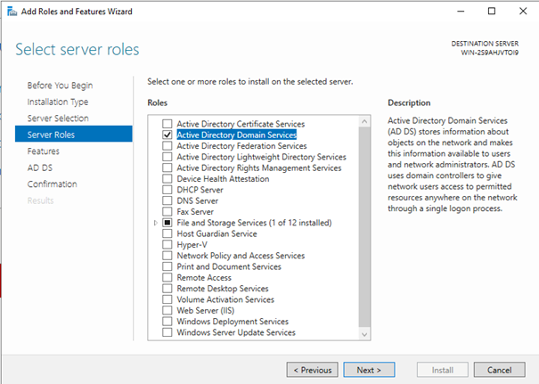

Un onglet AD DS apparaît alors dans l’interface Server Manager ainsi qu’un deployment configuation flag. Dans le Deployment Configuration Wizard, il faut commencer par ajouter une forêt (Add a new forest) et nommer le Root Domain, ici poeiwin.local . Dans l’onglet suivant, on ajoute juste le mot de passe puis on passe tous les onglets jusqu’à l’installation.

Une fois l’installation terminée, il y a un redémarrage. Sur l’écran de connexion on voit alors que le nom du domaine a été ajouté (POEIWIN\Administrator au lieu d’Administrator seul). Après connexion, dans l’interface Server Manager, on peut voir qu’un onglet DNS (Dynamic Name System) est apparu.

## DHCP & DNS

Le DHCP (Dynamic Host Configuration Protocol) et le DNS (Domain Name System) sont deux éléments essentiels d’un réseau. Le DHCP est un protocole permettant d’assigner automatiquement des adresses IP et un masque aux machines connectées au réseau et tient un registre des IP attribuées. Cela évite notamment d’avoir à les assignées de façon manuelle à chaque ordinateur avec toutes les conséquences et problèmes que cela peut entraîner sur les très grands réseaux.

Le DNS quant à lui permet de faire le lien entre une adresse IP et un nom de domaine ou de machine. Lorsqu’un DNS est interrogé, il renvoie l’adresse IP correspondant au nom de domaine demandé afin de permettre la connexion. Dans le cas où le DNS interrogé ne possède pas l’entrée correspondant au nom de domaine, il va faire une requête (via le gateway ?) auprès d’autres DNS jusqu’à pouvoir retourner une IP. Le DNS a également la possibilité de faire une recherche inverse.

Le rôle DNS est créé au moment du déploiement de l’AD mais pas le rôle DHCP. Dans le Server Manager, il faut créer un nouveau rôle Manage | Add Roles and Features. Encore une fois, dans l’Installation Wizard, Role-based or feature-based installation, puis choisir le rôle DHCP server puis on ne change rien jusqu’à l’installation.

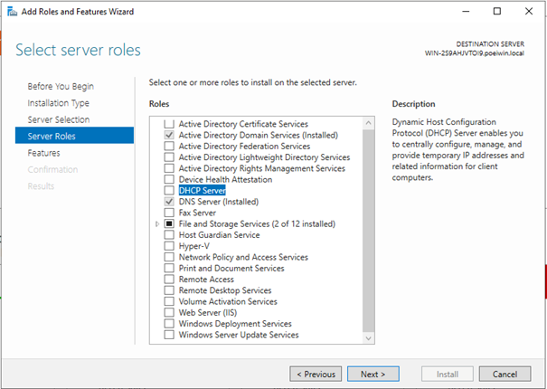

Un onglet DHCP apparaît alors dans l’interface Server Manager. Dans le DHCP Post-install Configuration Wizard, rien à faire, on clique sur Commit. On veut maintenant créer un DHCP scope utilisable par le réseau. Pour cela, dans l’interface DHCP, clique droit sur IPv4 et choisir New Scope .

Dans le New scope wizard, on nomme le nouveau scope (ici MyScope), puis on va configurer le IP adress range. Cette plage correspond aux adresses IP utilisables par le réseau. Nous n’ajoutons pas de plage d’exclusion dans Add exclusions and delay et on laisse le Lease duration par défaut, de même pour Configure DHCP options. Dans Router (Default Gateway), on ajoute l’adresse 192.168.44.2 qui est l’IP Gateway du réseau. On valide le reste et on active le DHCP scope.

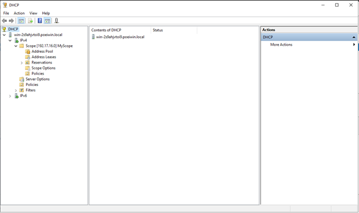

Dans le DNS Manager, il est possible de créer des nouveaux hôtes (New Host). Cet enregistrement permet notamment d’établir la connexion entre le domaine et l’adresse IP de l’hôte. Compte tenu des conventions de nommage des machines, il peut être plus simple de leur attribuer un alias pointant vers l’enregistrement de cette machine (ici HostTest_ALIAS pointe vers l’hôte HostTest).

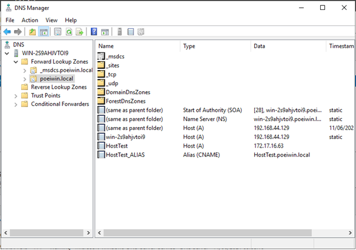

## Organizational Units, groupes et utilisateurs

Les Organizational Units (OUs) permettent d’appliquer des stratégies de groupes et reflètent généralement l’organisation de l’entreprise. Les OUs peuvent contenir d’autres OUs, des utilisateurs, des machines, des groupes ou tout autre subdivision facilitant, par exemple, la gestion des accès aux différents domaines, aux dossiers partagés ou aux applications. Il est également possible de déléguer la gestion des OUs aux groupes lui appartenant.
Ces subdivisions peuvent être ajoutées via le panneau Active Directory Users and Computers. Pour cela, clic-droit sur le nom de forêt (ici poeiwin.local) puis New déroule une liste d’option contenant notamment Computer, Group, Organizational Unit et User. On peut facilement créer une organisation complète avec des OUs contenant d’autres OUs.

Il est ensuite possible de créer des groupes auxquels les utilisateurs (ou machines) seront assignés et qui leur donneront ou non certains droits. On peut par exemple dans Administration | Groups créer un premier groupe rôle qui sera lui-même membre d’un groupe d’accès en lecture (via clic-droit Add to group).

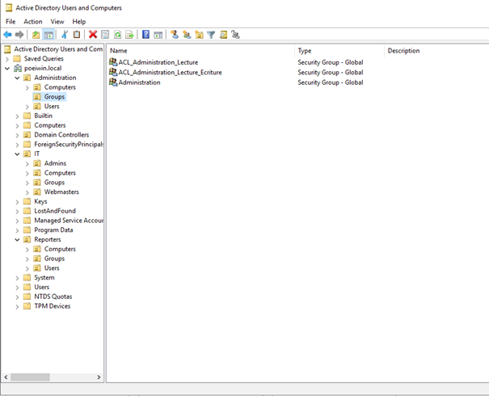

De la même manière, il est possible de créer un utilisateur (New | User) dans l’OU Administration-Users et de l’affecter ensuite au groupe administration. Lors de l’étape de création de l’utilisateur, il est possible de gérer des règles concernant le mot de passe. Une copie de cet utilisateur peut également être réalisée et désactivée afin d’en faire un template dont certains champs pourront être pré-remplis.

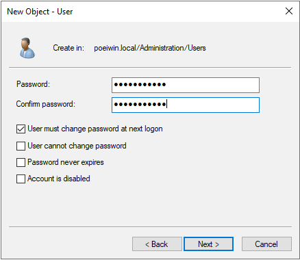
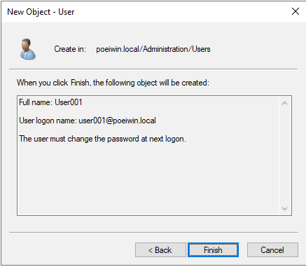

## Partages et DFS

Depuis le Server Manager, il est également possible de créer et configurer des dossiers partagés sous File and Storage Services | Share. On peut par exemple partager un dossier AdministrationGroup créer à la racine et donner les permissions en lecture au groupe ACL_Administration_Lecture créé précédemment. Ici le dossier a été partagé à l’aide du protocole SAMBA (SMB).

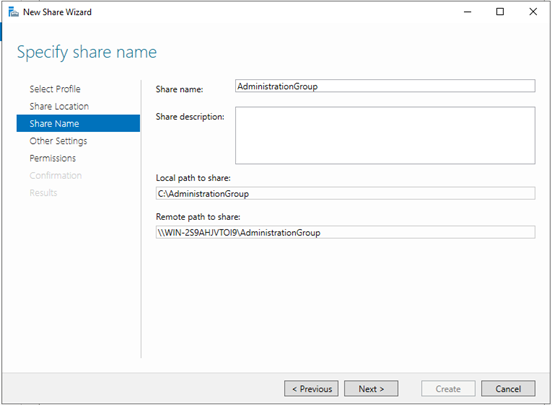
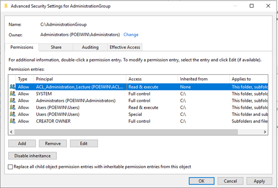

Pour des partages répartis sur plusieurs serveurs, il est possible de mettre en place un serveur DFS (Distributed File System) via l’ajout d’un rôle dans l’interface Server Manager | Add roles and features.

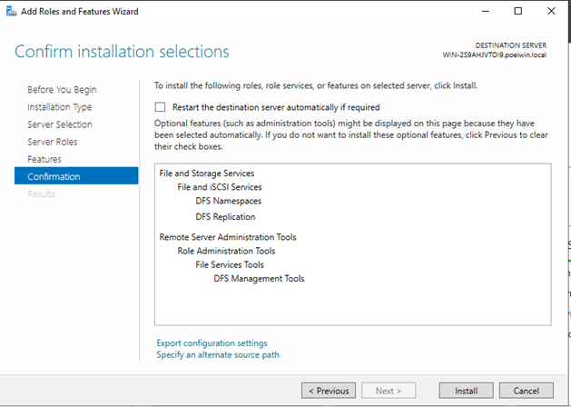

Ensuite, l’interface DFS Management permet de créer de nouveaux Namespace sous lesquels on pourra ajouter des dossiers partagés existant tels que AdministrationGroup. Il est également possible de répliquer un DFS sur plusieurs serveurs et sites. La réplication peut être unidirectionnelle (afin de centraliser des sauvegardes sur un serveur dédié par exemple) ou multidirectionnelle (afin d’avoir le même contenu sur plusieurs serveurs).

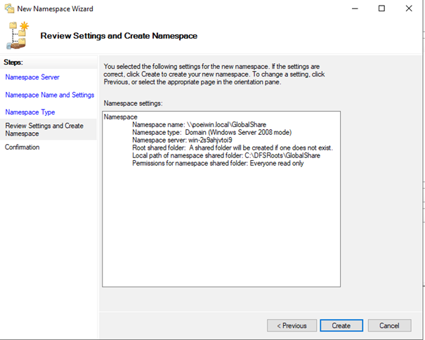
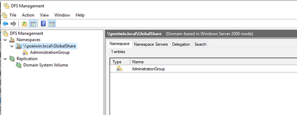

## Software Update Services

Afin de maintenir à jour les machines connectées au réseau et filtrer les mises à jour qui leur seront appliquées, il est nécessaire de mettre en place le Windows Software Update Services (WSUS). Pour cela, on commence par créer un dossier WSUS à la racine (C:\\WSUS) afin de stocker les mises à jour. Ensuite, il faut créer un nouveau rôle WSUS via le Server Manager. Dans l’onglet WSUS | Rôle Services, on conserve les options WSUS et WID pour le stockage et on pointe le dossier C:\\WSUS créé précédemment. On laisse le reste par défaut jusqu’à l’installation.

Une fois l’installation terminée, un serveur IIS (Internet Information Service) est créé dans l’interface de Server Manager. IIS est un serveur web qui permettra à WSUS de fonctionner et aux différentes machines du réseau d’accéder aux mises à jour.

On passe ensuite à la tâche de post-installation en cliquant sur le flag dans le Server Manager et on entame la configuration avec le WSUS Wizard. On sélectionne Synchronize from Microsoft Update pour l’upstream server. Dans notre cas, on n’utilise pas de proxy server, cependant dans la réalité, il est nécessaire d’en avoir un notamment pour surveiller les échanges entre le domaine et l’extérieur. On débute la connexion puis on configure les langues et produits qui seront pris en charge, on fixe la synchronisation (Sync Schedule) à une fois par jour puis on lance la synchronisation initiale.

Le panneau Update Service permet d’obtenir des informations sur les mises à jour nouvelles, révisées ou expirées, de connaître l’état des mises à jour pour les machines connectées au réseau ainsi que de générer des rapports. Depuis ce panneau, on peut également décider d’approuver (manuellement ou automatiquement) des mises à jour pour certains groupes de machines.

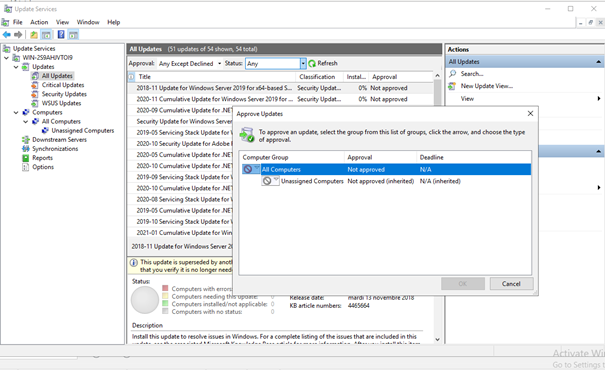

## Backup

Les données sur les serveurs sont généralement importantes et ont donc besoin d’une protection contre une perte éventuelle ou une corruption de certains fichiers. Pour répondre à ce genre de situation, il est possible de réaliser des sauvegardes (backup) afin qu’elles puissent être utilisées pour récupérer le serveur en minimisant la perte potentielle. La sauvegarde peut être stockée sur différents types de supports et à différentes localisations géographiques. Dans notre cas, la sauvegarde sera effectuée sur un disque supplémentaire créé sur la machine virtuelle.

Pour créer le serveur de sauvegarde, depuis le Server Manager, manage | add roles and features , il faut ajouter la fonctionnalité Windows Server Backup, il n’y a pas besoin de créer un nouveau rôle dans ce cas.
Le Server Backup Wizard permet notamment de mettre en place un Backup Schedule. Pour ce dernier, on choisit l’option Full server, on fixe une sauvegarde tous les jours à 21h et on choisit de stocker la sauvegarde dans un disque dur dédié (le disque supplémentaire créé sur la machine virtuelle).

Le Server Backup Wizard donne également accès aux informations sur les sauvegardes (planifiées, réussies, erreurs, etc).

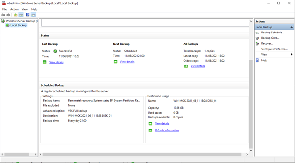
